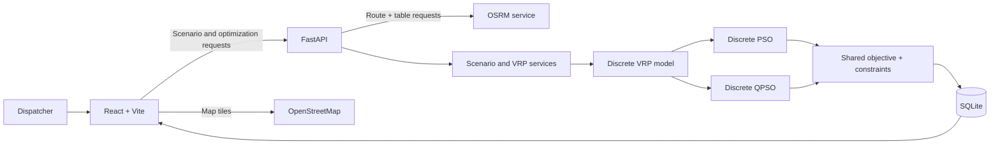
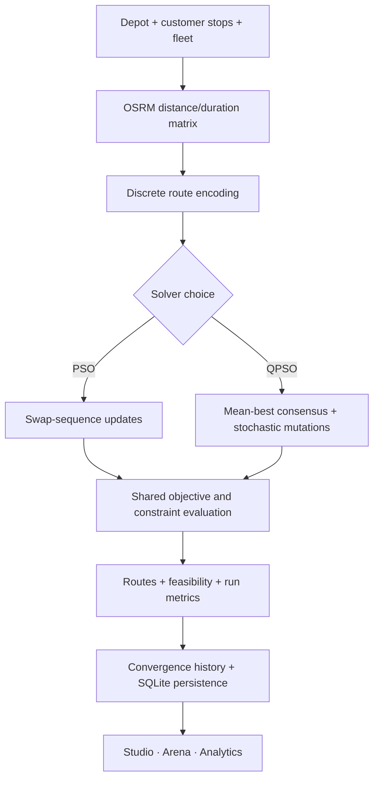

<div align="center">

# 🚦 IROS — VEDIORA

### **Quantum-Inspired Intelligent Route Optimization System**

**Multi-vehicle delivery planning · Real-road routing · Discrete PSO & QPSO**

<p>
  <a href="https://iros-chi.vercel.app"></a>
  <a href="https://iros-mipi.onrender.com/docs"></a>
</p>

<p>
  
  
  
</p>

<p>
  
  
  
  
  
  
</p>

**[Launch IROS](https://iros-chi.vercel.app) · [API documentation](https://iros-mipi.onrender.com/docs) · [Health check](https://iros-mipi.onrender.com/health) · [GitHub repository](https://github.com/ayan-shaikh-78690/IROS)**

**Smart India Hackathon 2026 · Problem Statement 26137 · Team VEDIORA · Team ID 120148**

</div>

---

## 📑 Table of Contents

- [🚦 Project Overview](#-project-overview)
- [🎯 Problem and Solution](#-problem-and-solution)
- [✨ Key Features](#-key-features)
- [🗺️ Routing and Traffic Accuracy](#️-routing-and-traffic-accuracy)
- [🏗️ System Architecture](#️-system-architecture)
- [🧠 Algorithmic Foundation](#-algorithmic-foundation)
- [📊 PSO vs QPSO](#-pso-vs-qpso)
- [🌱 Evaluation and Potential Use Cases](#-evaluation-and-potential-use-cases)
- [🛠️ Technology Stack](#️-technology-stack)
- [📁 Repository Structure](#-repository-structure)
- [🔌 API Reference](#-api-reference)
- [🚀 Quickstart](#-quickstart)
- [🌐 Deployment](#-deployment)
- [🧭 Milestones and Roadmap](#-milestones-and-roadmap)
- [📚 References and Attribution](#-references-and-attribution)

---

## 🚦 Project Overview

**IROS (Intelligent Route Optimization System)** is a fleet-planning application developed by **Team VEDIORA** for **Smart India Hackathon 2026 — Problem Statement 26137**.

IROS helps a planner build a delivery scenario, distribute customer stops among vehicles, and search for a useful visit order under vehicle capacity and time-window constraints. It combines real-road routing with discrete **Particle Swarm Optimization (PSO)** and **Quantum-behaved Particle Swarm Optimization (QPSO)** solvers, then records run metrics for inspection.

The demonstration region is **Ahmedabad–Gandhinagar, Gujarat, India**. Users can also enter locations through the map or address input.

> [!IMPORTANT]
> **Traffic limitation:** The current system does not use live traffic data or simulate time-varying traffic. Its congestion objective term is a baseline proxy derived from route duration. A dynamic traffic model is future work.

### At a glance

| 🗺️ Road-aware | 🚚 Fleet-aware | 🧠 Two solvers | 📈 Inspectable runs |
|---|---|---|---|
| OSRM route geometry and pairwise costs | Depot, customer stops, multiple vehicles | Discrete PSO and QPSO | Fitness, feasibility, runtime, convergence history |

---

## 🎯 Problem and Solution

Delivery planning is a **Vehicle Routing Problem (VRP)**. A fleet plan must assign stops to vehicles, choose each vehicle's visit order, respect payload limits, and meet customer time windows. The search space grows quickly as the number of stops increases.

| Planning challenge | IROS approach |
|---|---|
| Assigning many stops across vehicles | Discrete multi-vehicle route representation and optimization |
| Respecting vehicle payload limits | Capacity checks and violation penalties |
| Meeting delivery windows | Arrival-time and service-duration evaluation |
| Estimating road routes between locations | OSRM route and table requests using road-network data |
| Understanding solver behavior | Per-run metrics, feasibility indicators, and convergence history |
| Comparing optimization approaches | PSO and QPSO can be evaluated on the same scenario |

### Typical workflow

```text
┌────────────────────┐    ┌──────────────────┐    ┌───────────────────┐
│ Build a scenario   │ →  │ Get road costs   │ →  │ Run PSO or QPSO  │
│ Depot, stops, fleet│    │ OSRM route/table│    │ Discrete VRP      │
└────────────────────┘    └──────────────────┘    └─────────┬─────────┘
                                                            │
┌────────────────────┐    ┌──────────────────┐              │
│ Review and compare │ ←  │ Save run data    │ ←────────────┘
│ Routes + analytics │    │ SQLite           │
└────────────────────┘    └──────────────────┘
```

---

## ✨ Key Features

<details open>
<summary><strong>🧩 Scenario Lab · Define the delivery problem</strong></summary>
<br>

- Select or enter a depot and delivery-stop locations.
- Configure the vehicle fleet, capacities, customer demands, and time windows.
- Use scenario presets or customize the scenario.
- Save scenario, depot, stop, and fleet data in SQLite.

</details>

<details>
<summary><strong>🗺️ Real-road routing · See routes on the map</strong></summary>
<br>

- Render interactive maps with Leaflet and OpenStreetMap tiles.
- Request OSRM road-following geometry, distance, duration, and pairwise matrices.
- Use a clearly labeled geometric fallback when the routing service is unavailable.

</details>

<details>
<summary><strong>⚙️ Optimization Studio · Build a fleet plan</strong></summary>
<br>

- Run discrete PSO or QPSO with configurable population and iteration settings.
- Inspect vehicle assignment, stop order, route geometry, fitness breakdown, and feasibility.
- Review convergence and comparisons to the scenario's initial baseline.

</details>

<details>
<summary><strong>🏟️ Algorithm Arena · Compare the solvers</strong></summary>
<br>

- Run PSO and QPSO on the same scenario and initial conditions.
- Compare the measured fitness, runtime, feasibility, and convergence returned by the run.
- View the corresponding fleet route plans.

The comparison describes the runs performed; it does not claim that one algorithm always wins.

</details>

<details>
<summary><strong>📊 Analytics · Inspect recorded results</strong></summary>
<br>

- Browse saved optimization runs and scenario history.
- Review route metrics, constraint feasibility, vehicle utilization, and convergence history.
- Inspect computed before/after measures for the selected scenario.

</details>

### Constraints represented in the solver

| Constraint | Evaluation |
|---|---|
| Customer coverage | Check customer visits for omissions and duplicates |
| Vehicle capacity | Compare assigned demand with each vehicle's capacity |
| Time windows | Evaluate arrival against earliest/latest customer times |
| Service duration | Include stop-handling time in route schedules |
| Depot hours | Include depot opening and closing times in feasibility checks |

---

## 🗺️ Routing and Traffic Accuracy

The frontend uses **OpenStreetMap map tiles** through Leaflet. The backend calls the configured **OSRM HTTP service** for road-following routes and pairwise route matrices. The default routing endpoint is the public OSRM server.

If OSRM is unavailable or cannot return a route, the backend can return a **geometric fallback** based on Haversine distance and a fixed assumed speed. The API marks this result as a fallback. It is an approximation, not a road route or verified travel-time estimate.

| Capability | Current implementation status |
|---|---|
| OpenStreetMap map tiles | Used by the frontend |
| OSRM route geometry and distance/duration matrices | Requested by the backend |
| Haversine fallback | Implemented; approximation only |
| Congestion objective term | Baseline proxy proportional to route duration |
| Dynamic congestion / peak-hour simulation | Not implemented; traffic service is a placeholder |
| Live traffic feed / automatic traffic rerouting | Not implemented |
| OSMnx network download / local GraphML cache | Not implemented |

IROS requires network access for normal OSRM routing and map tiles. It is **not** a fully offline routing system.

---

## 🏗️ System Architecture



### Layer view

| Layer | Responsibility | Main implementation |
|---|---|---|
| 1 · User experience | Scenario entry, maps, results, analytics | React, Vite, Leaflet |
| 2 · API client | Send requests and present responses | Frontend API service |
| 3 · Application API | Health, routing, VRP, scenarios, optimization | FastAPI routers |
| 4 · Routing integration | Road route geometry and pairwise costs | OSRM HTTP client |
| 5 · VRP model | Discrete route encoding and feasibility | VRP models, encoder, constraint evaluator |
| 6 · Search and objective | PSO/QPSO run, cost, convergence telemetry | Optimization modules |
| 7 · Persistence | Scenario, fleet, stop, run, result, and route records | SQLite |
| 8 · External map services | Basemap, routing, optional address lookup | OpenStreetMap, OSRM, Nominatim |

### Optimization flow



---

## 🧠 Algorithmic Foundation

### Discrete multi-vehicle VRP

Each candidate solution stores customer order and vehicle partitions as discrete routes. The solver's repair logic keeps customer coverage valid as route candidates are transformed. Route distance and duration are obtained from the routing matrix, then feasibility and penalties are evaluated for the fleet plan.

### Shared multi-objective evaluation

At a high level, the fitness score combines weighted distance and duration costs, a congestion proxy, and constraint penalties:

```text
Fitness = distance cost + duration cost + congestion proxy + constraint penalties
```

The congestion component is currently derived from total route duration using a baseline factor. It is **not** an independently measured traffic condition. Results also preserve raw metrics and constraint outcomes, rather than reporting only a single score.

### Quantum-inspired search

The QPSO implementation adapts quantum-behaved search ideas to the discrete route space. It forms a mean-best edge-frequency consensus and local attractors from personal/global best candidates, then uses stochastic permutation changes controlled by a contraction/expansion parameter.

> **QPSO is quantum-inspired software.** It does not use a quantum computer or quantum hardware.

---


## 🧠 Algorithmic & Mathematical Foundation

### 1. Directed Weighted Graph Formulation
The road network is represented as $G = (V, E)$, where directed edge $e_{ij} \in E$ has dynamic weight:

$$W_{ij} = \alpha \cdot \hat{d}_{ij} + \beta \cdot \hat{t}_{ij} + \gamma \cdot \hat{c}_{ij}$$

* $\hat{d}_{ij}$: Normalized road distance
* $\hat{t}_{ij}$: Normalized travel duration
* $\hat{c}_{ij}$: Congestion index factor
* $\alpha + \beta + \gamma = 1$: User-configurable objective weights

### 2. Multi-Objective Fitness Score
$$F(R) = w_d D(R) + w_t T(R) + w_c C(R) + \lambda P(R)$$

where $P(R) = P_{\text{capacity}} + P_{\text{time\_window}} + P_{\text{coverage}} + P_{\text{validity}}$ represents penalty terms for operational violations.

### 3. Quantum-Behaved Particle Swarm Optimization (QPSO)
Unlike classical PSO with velocity vectors ($v_i$), QPSO treats particles as moving in a quantum delta potential well centered at local attractor $p_i = \phi \cdot pbest_i + (1 - \phi) \cdot gbest$:

$$x_i^{t+1} = p_i \pm \beta \cdot \left| mbest - x_i^t \right| \cdot \ln\left(\frac{1}{u}\right)$$

* $mbest = \frac{1}{M} \sum_{i=1}^{M} pbest_i$: Swarm mean best position
* $\beta$: Contraction-expansion coefficient (controls convergence vs exploration)
* $u \sim U(0,1)$: Uniform random variable governing quantum tunneling probability

---

## 📊 Competitive Comparison

| Feature / Capability | IROS (VEDIORA) | Google Maps / Mapbox | OptimoRoute / LogiNext | Classical Metaheuristics (GA / PSO) |
| :--- | :---: | :---: | :---: | :---: |
| **Point-to-Point Navigation** | ✅ | ✅ | ✅ | ✅ |
| **Real-Road Network Extraction (OSM)** | ✅ | ✅ | ✅ | ❌ |
| **Multi-Vehicle VRP Optimization** | ✅ | ❌ | ✅ | ✅ |
| **Vehicle Capacity & Time Windows (VRPTW)** | ✅ | ❌ | ✅ | ❌ |
| **Dynamic Congestion Weighting** | ✅ | ❌ | ❌ | ❌ |
| **Quantum-Behaved Global Convergence (QPSO)** | ✅ | ❌ | ❌ | ❌ |
| **Fully Offline-Resilient & Local Graph Caching** | ✅ | ❌ | ❌ | ❌ |
| **Zero API Cost per Routing Query** | ✅ | ❌ | ❌ | ✅ |
| **Interactive Simulation Lab (React + Leaflet)** | ✅ | ❌ | ✅ | ❌ |

---

## 📊 PSO vs QPSO

This table compares the **implemented search mechanisms**, not benchmark outcomes.

| Aspect | Discrete PSO | Discrete QPSO |
|---|---|---|
| Route representation | Customer permutations and vehicle partitions | Customer permutations and vehicle partitions |
| Search movement | Ordered swap-sequence velocity | Attractor-based stochastic permutation updates |
| Search memory | Personal best and global best | Personal best, global best, and mean-best consensus |
| Shared evaluation | Same objective and constraint evaluator | Same objective and constraint evaluator |
| How IROS compares results | Run telemetry and convergence history | Run telemetry and convergence history |

Actual results depend on the scenario, routing matrix, solver parameters, and random seed. The project does not claim a universal winner or fixed speed advantage.

---

## 🌱 Evaluation and Potential Use Cases

IROS records per-run values such as route distance, travel duration, fitness breakdown, constraint feasibility, runtime, vehicle assignments, and convergence history. These values support scenario-specific review. They are **not evidence of guaranteed real-world savings** by themselves.

Potential areas to explore with a validated deployment include:

- urban delivery and parcel-fleet planning;
- retail distribution scenarios with delivery windows;
- fleet planning exercises for municipal or campus services.

Emergency response, live traffic adaptation, and city-wide traffic impact analysis are not current demonstrated capabilities.

---

## 🛠️ Technology Stack

| Area | Technologies |
|---|---|
| Frontend | React 19, Vite 8, React Router |
| Maps and UI | Leaflet, OpenStreetMap tiles, Lucide React |
| Backend | Python 3.11, FastAPI, Uvicorn, Pydantic |
| HTTP/configuration | HTTPX, Requests, python-dotenv |
| Road routing | OSRM HTTP API |
| Address lookup | Local landmark gazetteer; optional OpenStreetMap Nominatim |
| Persistence | SQLite |
| Containers/web serving | Docker, Docker Compose, Nginx |
| Hosting | Vercel frontend, Render backend |

<p align="center">
  
  
  
  
</p>

> **Dependency accuracy:** OSMnx, NetworkX, NumPy, and MapLibre are not current backend/frontend dependencies. The OSM network-download module is a placeholder; IROS currently requests road routes and matrices from OSRM and does not load or cache local GraphML road networks.

---

## 📁 Repository Structure

```text
IROS/
├── backend/
│   ├── api/                 # Health, routing, VRP, scenario, and optimization endpoints
│   ├── data/                # SQLite initialization and persistence
│   ├── models/              # Request schemas and VRP domain models
│   ├── optimization/        # PSO, QPSO, objective, constraints, discrete encoding
│   ├── services/            # Routing, VRP, graph, OSM, and traffic service modules
│   ├── config.py            # Backend settings
│   ├── main.py              # FastAPI app entry point
│   ├── requirements.txt
│   └── Dockerfile
├── frontend/
│   ├── src/
│   │   ├── components/      # Reusable interface and map components
│   │   ├── config/          # Map provider settings
│   │   ├── context/         # Scenario and theme state
│   │   ├── pages/           # Home, Scenario Lab, Studio, Arena, Analytics, and more
│   │   ├── services/        # Backend API client
│   │   └── utils/           # Geocoding helpers
│   ├── Dockerfile
│   ├── nginx.conf
│   ├── package.json
│   └── vercel.json
├── docker-compose.yml
├── .env.example
└── README.md
```

---

## 🔌 API Reference

The backend's interactive OpenAPI page is [`/docs`](https://iros-mipi.onrender.com/docs). Endpoint names below match the FastAPI route declarations in the project.

### Health and service status

| Method | Endpoint | Description |
|---|---|---|
| `GET` | `/` | Backend product and service metadata |
| `GET` | `/health` | Health status |
| `GET` | `/api/routes/` | Routing provider status |
| `GET` | `/api/optimization/` | Optimization status and supported solver metadata |

### Routing and VRP

| Method | Endpoint | Description |
|---|---|---|
| `POST` | `/api/routes/calculate` | Calculate route geometry, distance, duration, and legs |
| `POST` | `/api/routes/matrix` | Calculate pairwise route distance and duration matrices |
| `GET` | `/api/routes/graph-schema` | Return the transportation graph/cost schema |
| `GET` | `/api/vrp/formulation` | Return VRP formulation and constraint metadata |
| `POST` | `/api/vrp/matrix` | Build matrix information for a VRP problem |
| `POST` | `/api/vrp/decode` | Decode a discrete solution into vehicle routes |
| `POST` | `/api/vrp/evaluate` | Evaluate candidate routes, feasibility, and fitness |

### Optimization and run history

| Method | Endpoint | Description |
|---|---|---|
| `POST` | `/api/optimization/pso` | Execute the discrete PSO solver |
| `POST` | `/api/optimization/qpso` | Execute the discrete QPSO solver |
| `POST` | `/api/optimization/run` | Execute the solver selected in the request |
| `POST` | `/api/optimization/compare` | Compare PSO and QPSO under the same problem conditions |
| `GET` | `/api/optimization/runs` | List recent saved optimization runs |
| `GET` | `/api/optimization/runs/{run_id}` | Retrieve a saved run and its metrics |
| `GET` | `/api/optimization/runs/{run_id}/history` | Retrieve convergence history and iteration snapshots |
| `GET` | `/api/optimization/runs/{run_id}/routes` | Retrieve saved vehicle routes and geometry |

### Scenario persistence

| Method | Endpoint | Description |
|---|---|---|
| `GET` | `/api/scenarios/` | List saved scenarios |
| `POST` | `/api/scenarios/` | Create a scenario |
| `GET` | `/api/scenarios/{scenario_id}` | Retrieve scenario, fleet, stops, and latest run |
| `PUT` | `/api/scenarios/{scenario_id}` | Update a scenario |
| `DELETE` | `/api/scenarios/{scenario_id}` | Delete a scenario and associated runs/routes |
| `POST` | `/api/scenarios/{scenario_id}/baseline` | Calculate and save the initial unoptimized plan |
| `GET` | `/api/scenarios/{scenario_id}/latest-run` | Retrieve the latest saved run for a scenario |

---

## 🚀 Quickstart

### Prerequisites

- Docker Desktop with Docker Compose
- Internet access for OSRM routing, OpenStreetMap tiles, and optional Nominatim lookup

### Option 1 · Full stack with Docker Compose

```bash
git clone https://github.com/ayan-shaikh-78690/IROS.git
cd IROS
docker compose up --build
```

| Service | Local URL |
|---|---|
| Frontend dashboard | [http://localhost:5173](http://localhost:5173) |
| Backend health | [http://localhost:8000/health](http://localhost:8000/health) |
| FastAPI Swagger docs | [http://localhost:8000/docs](http://localhost:8000/docs) |

Stop the containers:

```bash
docker compose down
```

> **SQLite note:** The Compose file does not define a persistent volume. Data written inside a container may not survive container replacement. Configure a volume if you need durable local container data.

### Option 2 · Run frontend and backend separately

**Backend** (Python 3.11 recommended):

```bash
cd backend
python -m venv .venv
```

Activate the environment, then install and run:

```bash
pip install -r requirements.txt
uvicorn main:app --reload --host 127.0.0.1 --port 8000
```

**Frontend** (Node.js and npm):

```bash
cd frontend
npm install
npm run dev
```

The Vite development server runs at `http://localhost:5173`. Set `VITE_BACKEND_URL` to `http://127.0.0.1:8000` when running the frontend separately if your local configuration needs it.

---

## 🌐 Deployment

| Component | Host | Link |
|---|---|---|
| Frontend | Vercel | [iros-chi.vercel.app](https://iros-chi.vercel.app) |
| Backend | Render | [iros-mipi.onrender.com](https://iros-mipi.onrender.com) |
| API documentation | FastAPI | [Open `/docs`](https://iros-mipi.onrender.com/docs) |
| Health endpoint | FastAPI | [Open `/health`](https://iros-mipi.onrender.com/health) |

The frontend reads its backend address from `VITE_BACKEND_URL`; Docker Compose configures the local value as `http://localhost:8000`. Hosted availability and response time depend on the hosting platform and external routing service.

---

## 🧭 Milestones and Roadmap

| Milestone | Status | Scope |
|---|---|---|
| **M1 · Application foundation** | ✅ Implemented | React/Vite UI, FastAPI service, Docker setup |
| **M2 · Routing and VRP foundation** | ✅ Implemented | OSRM route/matrix calls, discrete routes, decoder, constraints, SQLite scenarios |
| **M3 · Classical PSO** | ✅ Implemented | Discrete swap-sequence PSO and run telemetry |
| **M4 · Quantum-inspired QPSO** | ✅ Implemented | Discrete QPSO, convergence telemetry, PSO comparison |
| **M5 · Traffic modeling** | 🔜 Future work | Implement and validate explicit time-dependent congestion modeling |
| **M6 · Broader evaluation** | 🔜 Future work | Repeatable experiments across scenarios, sizes, seeds, and solver settings |
| **M7 · Live traffic and rerouting** | 🔜 Future work | Evaluate a suitable live data source and operational rerouting |

### Honest evaluation

IROS reports metrics from actual application runs. This README does not claim fixed reductions in fuel use, cost, emissions, delivery delays, or solver runtime. Any future performance claims should publish the scenarios, parameters, seeds, and measured results behind them.

---

## 📚 References and Attribution

1. Kennedy, J. and Eberhart, R. “Particle Swarm Optimization.” *Proceedings of the IEEE International Conference on Neural Networks*, 1995. [IEEE Xplore](https://ieeexplore.ieee.org/document/488968)
2. Sun, J., Feng, B. and Xu, W. “Particle swarm optimization with particles having quantum behavior.” *Proceedings of the IEEE Congress on Evolutionary Computation*, 2004. [IEEE Xplore](https://ieeexplore.ieee.org/abstract/document/1330875/)
3. [OSRM HTTP API documentation](https://project-osrm.org/docs/v26.5.0/http)
4. [OpenStreetMap copyright and attribution](https://www.openstreetmap.org/copyright)
5. [Leaflet documentation](https://leafletjs.com/reference.html)

Map data © [OpenStreetMap contributors](https://www.openstreetmap.org/copyright). OSRM, map tiles, and optional geocoding rely on external services and their availability and usage policies.

---

<div align="center">

### 🚦 VEDIORA · IROS

**Plan smarter · Compare transparently · Keep constraints in view**

[Launch demo](https://iros-chi.vercel.app) · [Explore API](https://iros-mipi.onrender.com/docs) · [View source](https://github.com/ayan-shaikh-78690/IROS)

**Smart India Hackathon 2026 · Problem Statement 26137 · Team ID 120148**

</div>
